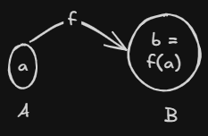
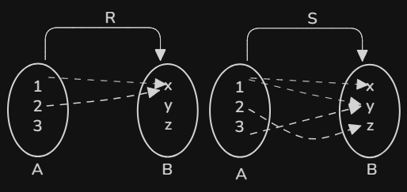

# Function
- A function **$f$** from **$A$** to **$B$** which is denoted as **$f(a) = b$**,
- $F:A-B$ is a relation from **A** to **B** such that for all $a \in \mathrm{Dom} (f)$. 
- $f(a)$ is the $f$ relative set of a contains just one element of B.
- Function are also called **Mapping** or **Transformation**
- The element $a$ is called an argument of the function $f$ and $f(a)$ is called the value of function for the argument '$a$' and also referred to as the image of $a$ under $f$.

## Example 1: 
Let $A = \{1, 2, 3, 4\}$ and $B = \{a, b, c, d\}$. 
Let $f = \{(1,a), (2,a), (3,d), (4,c)\}$.

**Solution:** 
Here we have the following mappings: 
* $f(1) = a$ 
* $f(2) = a$ 
* $f(3) = d$ 
* $f(4) = c$ 
Since each input $f(n)$ maps to a single, distinct value, $f$ is a valid function.
## Example 2:
Let $A = \{1,2,3\}$ and $B = \{x,y,z\}$.
Consider  the relation $R = \{(1,x),(2,x)\}$ and $S = \{(1,x),(1,y),(2,z),(3,)\}$

S is not a function, since $S(1) = \{x,y\}$
