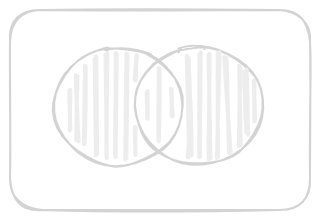
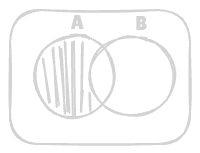
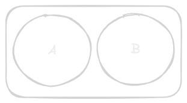
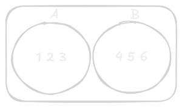
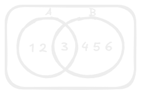

# Set Theory
A set is a well defined collection of distinct objects. These objects are called elements or members of the set we denote a set by using curly brackets.

$$ 
A = \lbrace{2, 4, 6, 8, 10\rbrace}
$$
- **Membership:** If something is in a set, we say it is a member of the set denoted by $\in$ if not, we use $\notin$.
- **Example:**
	- In the set $\lbrace{1,2,3\rbrace}$
	- $2 \in \{1,2,3\}$ but $5 \notin \lbrace{1,2,3\rbrace}$

## Union of Sets
- The union of sets $A$ and $B$, denoted by $A\cup B$ is the set of distinct elements that belong to set $A$ or set $B$ or both.
- The operation can be represented as: 

$$
A \cup B = \lbrace{ x \mid x \in A\space  or\space x \in B\rbrace}
$$
- The union includes every element that appears  in the either  of the two set, without any repetition.
- **Example:**
	- If $A = \lbrace{1,2,3\rbrace}$  and $B = \lbrace{3,4,5\rbrace}$ then 

$$
A \cup B = \lbrace{1,2,3,4,5\rbrace}
$$

## Intersection of Sets
- The intersection of the set $A$ and $B$ is denoted $A \cap B$, is the set of elements that belong to both $A$ and $B$.
- This operation is represented as: 

$$
A \cap B = \lbrace{X: X \in A \ and\ X \in B\rbrace}
$$
- The intersection of contains only those elements that are present is both sets. Here , x represent the elements that are common to both set $A$ or $B$.
- Example:
	- If $A = \lbrace{1,2,3\rbrace}$ and $B = \lbrace{3,4,5\rbrace}$, then 

$$
A \cap B = \lbrace{3\rbrace}
$$

| [Union of Sets](#Union%20of%20Sets) | [Intersection of Sets](#Intersection%20of%20Sets) |
| ----------------------------------- | ------------------------------------------------- |
|    |           |

## Questions
---
> [!NOTE]
> ### **Question 1**
> Find the union of set A and B given that set $A = \lbrace{2,4,6\rbrace}$ and Set $B = \lbrace{4,10\rbrace}$.

>**Answer:** 
 
$$
A \cup B = \lbrace{2, 4, 6, 10\rbrace}
$$

> [!NOTE] 
> ### Question 2
> Find the intersection of set X and Y given $X =\lbrace{5,9,10,15\rbrace}$ and $Y = \lbrace{4,5,12\rbrace}$.

> **Answer:**

$$
X \cap Y = \lbrace{5\rbrace}
$$

> [!NOTE] 
> ### Question 3
> Let X and Y be the following sets:
> $X = \lbrace{15,9,11\rbrace}$
> $Y = \lbrace{11,9,2\rbrace}$>
> **Find the $X \cap Y$ and $X \cup Y$**

> **Answer:**
 
 $$
\begin{aligned}
X \cap Y &= \lbrace{9, 11\rbrace} \\
X \cup Y &= \lbrace{2, 9, 11, 15\rbrace}
\end{aligned}
$$
---

## Complement of Set
- If U is a universal set and X is any subset of U, then the complement of X consists of all the elements is U that are not in X. 

$$
X' = \lbrace{a: a \in U and \ x \in a\rbrace}
$$
- **Example:**
  - if the universal set $U = \lbrace{1,2,3,4,5,6\rbrace}$ and $A = \lbrace{1,2,3\rbrace}$ then 

$$
A' = \lbrace{4,5,6\rbrace}
$$
## Set Difference 
- The difference between set is a denoted by $A - B$ which is the set containing elements that are in A but not in B, all elements of A expect the element of B.
- **Example:**
   - If $A = \lbrace{1,2,3\rbrace}$ and $B = \lbrace{3,4,5\rbrace}$ then

$$
A - B = \lbrace{1,2\rbrace}
$$ 

												$[A - B = A - (A \cap B)]$

- In the below diagram, the set difference $A - B$ contains all the elements that are in $A$ but not in $B$.

## Disjoint Set
- Two set are said to be disjoint if their intersection is the empty set \[Set with no common\]
- If you try to find their intersection, you'll get the empty set which we denote by the symbol $\emptyset$ or $\lbrace{\rbrace}$ 
- **Example:**
	- Let $A = \lbrace{1,3,5,7,9\rbrace}$ and $B = \lbrace{2,4,6,8\rbrace}$
	- A and B are disjoint set since both of them have no common elements.

## Questions
---
> [!NOTE]
> ### Question 4
> Find the complement of set  $P$ given the universal set $U = \lbrace{10,20,30,40,50,60\rbrace}$ and $P = \lbrace{20\rbrace}$

> **Answer:**

$$
P = \lbrace{10,30,40,50,60\rbrace}
$$

> [!NOTE]
> ### Question 5
> Find the set difference of set $C$ and $D$ given that $C =\lbrace{1,4,7\rbrace}$ and $D = \lbrace{4,8\rbrace}$

> **Answer:**

$$
C - D = \lbrace{1,7\rbrace}
D - C = \lbrace{8\rbrace}
$$
> Set with only one term = Single term set.

## Properties of Set Operations
### Commulative Properties 
1. $A \cup B = B \cup A$
	  **Example:** $A = \lbrace{1,2,3\rbrace}$ and $B = \lbrace{4,5,6\rbrace}$ 
		 $A \cup B = \lbrace{1,2,3,4,5,6\rbrace}$
		 $B \cup A = \lbrace{4,5,6,1,2,3\rbrace}$
		 $\therefore A \cup B = B \cup A$
		 
2. $A \cap B = B \cap A$
	  **Example:** $A = \lbrace{1,2,3\rbrace}$ and $B = \lbrace{3,4,5,6\rbrace}$
		 $A \cap B = \lbrace{3\rbrace}$ 
		 $B \cap A = \lbrace{3\rbrace}$
		  
		 $\therefore A \cap B = B \cap A$

### Associative Proportion 
1. $A \cup (B \cup C) = (A \cup B) \cup C$
	  **Example:** $A = \lbrace{1,2\rbrace}$ , $B = \lbrace{3,4\rbrace}$ and $C = \lbrace{5,6\rbrace}$
		L.H.S: 
		 $A \cup (B \cup C) = A \cup (\lbrace{3,4,5,6\rbrace})$ 
			        $= \lbrace{1,2,3,4,5,6\rbrace}$
		R.H.S:
		 $(A \cup B) \cup C = \lbrace{1,2,3,4\rbrace} \cup \lbrace{5,6\rbrace}$
				    $= \lbrace{1,2,3,4,5,6\rbrace}$
	     $\therefore L.H.S = R.H.S$
	     Hence, $A \cup (B \cup C) = (A \cup B) \cup C$
2. $A \cap (B \cap C) = (A \cap B) \cap C$
	  **Example:** $A = \lbrace{2,3\rbrace}, B = \lbrace{2,4\rbrace} and C = \lbrace{2,5\rbrace}$
		 L.H.S:
		    $A \cap (B \cap C) = \lbrace{2\rbrace}$
		    $A \cap B = \lbrace{2\rbrace}$
		 R.H.S:
            $(A\cap B) \cap C = \lbrace{2\rbrace}$
		$\therefore A \cap (B \cap C) = (A \cap B) \cap C$
 