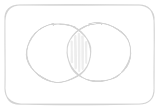

# Set Theory
A set is a well defined collection of distinct objects. These objects are called elements or members of the set we denote a set by using curly brackets.
$$ 
A = \{2, 4, 6, 8, 10\}
$$
- **Membership:** If something is in a set, we say it is a member of the set denoted by $\in$ if not, we use $\notin$.
- **Example:**
	- In the set $\{1,2,3\}$
	- $2 \in \{1,2,3\}$ but $5 \notin \{1,2,3\}$

## Union of Sets
- The union of sets $A$ and $B$, denoted by $A\cup B$ is the set of distinct elements that belong to set $A$ or set $B$ or both.
- The operation can be represented as: 
$$
A \cup B = \{ x \mid x \in A \text{ or } x \in B \}
$$
- The union includes every element that appears  in the either  of the two set, without any repetition.
- **Example:**
	- If $A = \{1,2,3\}$  and $B = \{3,4,5\}$ then 
$$
A \cup B = \{1,2,3,4,5\}
$$

## Intersection of Sets
- The intersection of the set $A$ and $B$ is denoted $A \cap B$, is the set of elements that belong to both $A$ and $B$.
- This operation is represented as: 
$$
A \cap B = \{X: X \in A \ and\ X \in B\}
$$
- The intersection of contains only those elements that are present is both sets. Here , x represent the elements that are common to both set $A$ or $B$.
- Example:
	- If $A = \{1,2,3\}$ and $B = \{3,4,5\}$, then 
$$
A \cap B = \{3\}
$$

| [Union of Sets](#Union%20of%20Sets)                    | [Intersection of Sets](#Intersection%20of%20Sets)             |
| ------------------------------------------------------ | ------------------------------------------------------------- |
|  |  |
## Questions
> [!NOTE] Question 1
> Find the union of set A and B given that set $A = \{2,4,6\}$ and Set $B = \{4,10\}$.
>
> **Answer:** 
> $$
> A \cup B = \{2, 4, 6, 10\}
> $$

> [!NOTE] Question 2
> Find the intersection of set X and Y given $X =\{5,9,10,15\}$ and $Y = \{4,5,12\}$.
>
> **Answer:**
> $$
> X \cap Y = \{5\}
> $$

> [!NOTE] Question 3
> Let X and Y be the following sets:
> $X = \{15,9,11\}$
> $Y = \{11,9,2\}$>
> Find the $X \cap Y$ and $X \cup Y$
>
> **Answer:**
> $$
> \begin{aligned}
> X \cap Y &= \{9, 11\} \\
> X \cup Y &= \{2, 9, 11, 15\}
> \end{aligned}
> $$

## Complement of Set
- If U is a universal set and X is any subset of U, then the complement of X consists of all the elements is U that are not in X. 
$$
X' = \{a: a \in U and \ x \in a\}
$$
- **Example:**
  - if the universal set $U = \{1,2,3,4,5,6\}$ and $A = \{1,2,3\}$ then 
$$
A' = \{4,5,6\}
$$
## Set Difference 
- The difference between set is a denoted by $A - B$ which is the set containing elements that are in A but not in B, all elements of A expect the element of B.
- **Example:**
   - If $A = \{1,2,3\}$ and $B = \{3,4,5\}$ then
$$
A - B = \{1,2\}
$$$$
A - B = A - (A \cap B)
$$
- In the below diagram, the set difference $A - B$ contains all the elements that are in $A$ but not in $B$.

## Discount Set
- Two set are said to be disjoint if their intersection is the empty set \[Set with no common\]
