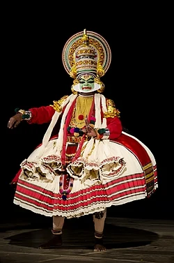

# Kathakali: The Classical Dance-Drama of Kerala

A Kathakali performer in traditional costume and makeup, showcasing the elaborate headpiece and face paint characteristic of this classical art form.

## Introduction

Kathakali is one of India's nine classical dance forms, originating from the southwestern state of Kerala. The word comes from two Malayalam words — *katha* (story) and *kali* (play) — literally meaning "story-play." It is a highly stylized dance-drama that synthesizes music, vocal performance, choreography, intricate hand gestures (*mudras*), and elaborate facial expressions to narrate tales from Hindu epics like the *Ramayana* and *Mahabharata*. What makes Kathakali unique is its incorporation of movements from ancient South Indian martial arts and its development within the courts and theatres of Hindu principalities.

## Origins and Early History

The fully developed style of Kathakali emerged around the 16th century, though its roots trace back to temple and folk arts of the 1st millennium CE. Its most immediate predecessor was *Ramanattam*, created by Kottarakkara Thampuran, a king fascinated by *Krishnanattam* — a dance-drama about Lord Krishna patronized by the Zamorins of Calicut. When his request to borrow a troupe was denied, he created his own art form based on the *Ramayana* and named it *Ramanattam*. As writers began creating stories from other texts like the *Mahabharata*, the name became inappropriate, and the art form was renamed *Kathakali*.

Kathakali also shares deep connections with *Kutiyattam*, the only surviving traditional form of Sanskrit drama in India, which originated around the 10th century. Elements such as elaborate costumes, makeup conventions, and gesture-based acting were absorbed from Kutiyattam. Additionally, the ancient martial art of *Kalaripayattu*, practiced by the warrior Nair caste in sunken gymnasiums called *kalaris*, significantly influenced the dancers' body movements, footwork, and physical training.

## Development and Royal Patronage

The 17th century marked a golden period for Kathakali. Vettathu Raja introduced crucial improvements: two singers for harmony, the *chengila* (cymbals) for rhythm, the *chenda* (a powerful drum originally used in temple rituals), and the *thiranokku* — a dramatic method of introducing characters from behind a satin curtain. The King of Kottarakkara also introduced Malayalam into the Sanskrit singing and presented plays in temple forecourts, making performances accessible to common people.

The art form was further refined by Kottayathu Thampuran (the King of Kottayam), who composed four major works based on the *Mahabharata*: *Kirmeeravadham*, *Bakavadham*, *Nivathakavacha Kalakeyavadham*, and *Kalyanasougandhikam*. These plays, known as the "Kottayam Kathakali," became foundational to its choreography, text, and performance system. In the 18th century, Kaplingadu Narayanan Namboothiri developed the *Kaplingadan* style, renowned for its vivid facial expressions.

## Costumes, Makeup, and Characters

One of the most visually striking aspects of Kathakali is its elaborate costume and makeup system. Performers wear large, ornate headpieces called *kireedam*, layered skirts, and heavy jewelry. The face is painted with vibrant colors according to the character type — a system known as *vesham*.

There are seven primary character types:
- **Pacha (Green):** Represents noble, divine, and heroic characters like Lord Rama and Krishna.
- **Kathi (Knife):** Depicts villainous characters with traits of arrogance and evil.
- **Kari (Black):** Used for demonic and evil female characters.
- **Thaadi (Beard):** Divided into *Vella Thaadi* (white beard for virtuous characters like Hanuman) and *Chuvanna Thaadi* (red beard for evil characters).
- **Minukku (Radiant):** Represents sages, brahmins, and female characters.
- **Stree Vesham:** Female roles.
- **Special Characters:** Unique roles with distinctive makeup.

The distinctive white facial border called *chutti*, made of thick rice paste, frames the painted face and emphasizes the intricate eye movements and facial expressions central to Kathakali acting.

## Music and Performance

A Kathakali performance is a total theatre experience. The text of a play is called *Attakatha* (where *attam* means dance/play and *katha* means story). Traditionally, the vocal performance is sung in Sanskritized Malayalam.

The musical ensemble typically includes vocalists, a *chenda* (cylindrical drum), *maddalam* (barrel-shaped drum), *chengila* (gong), and *ilathalam* (cymbals). The musicians guide the emotional tone of the performance. The dancers do not speak; they communicate entirely through *mudras* (hand gestures), *navarasas* (nine core emotions — love, humour, compassion, anger, courage, fear, disgust, wonder, and peace), and highly codified body movements.

## Decline and Revival

Kathakali flourished under royal and temple patronage for centuries but faced decline in the 19th century due to colonial invasions and the gradual reduction of royal support. It was the small *Kali Yogams* (troupes) and Namboodiri Brahmin families like the Olappamanna Mana that kept the tradition alive.

The turning point came in the early 20th century when renowned Malayalam poet Vallathol Narayana Menon, along with Mukunda Raja, founded the **Kerala Kalamandalam** in 1930 at Cheruthuruthy. This institution became the cradle of Kathakali's revival, standardization, and international recognition. Pattikkamthodi Ravunni Menon (1880–1948) played a crucial role in codifying Kathakali's scattered techniques and established the *Kalluvazhi chitta* (style), known for its controlled footwork and distinct eye movements.

## Conclusion

Kathakali stands today as one of India's most iconic classical art forms and a proud symbol of Kerala's rich cultural heritage. From its origins in the royal courts and temple theatres of 17th-century Kerala to its place on the global stage, Kathakali has survived centuries of change through the dedication of royal patrons, master teachers, and institutions like Kerala Kalamandalam. Its unique synthesis of dance, drama, music, martial arts, and religious devotion continues to captivate audiences worldwide, making it not merely a performance but a living tradition that embodies the eternal struggle between good and evil.
