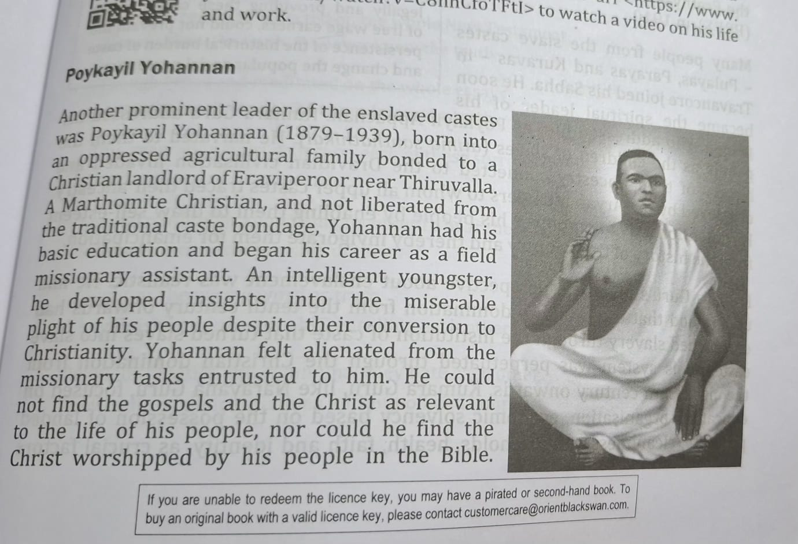

# The Problem of 'True Knowledge' by Poykayil Appacham

Points
- According to Sanil Mohan the Dalits social movement helped Dalits develop a new ideas of the goos life.
- This new outlook included:
  - New Ideas about work, Time and Family life.
  - Importance of 'cleanliness' introduced by missionaries.
  - Value of freedom and equality inspired dalits to improve their everyday life.
- Poykayil Yohanan through [[Prathyaksha Raksha Daiva Sabha]](PDRS) introduced:
  - New symbols and ways of prayers.
  - Rituals that reminded people of the suffering of slavery.
  - These rituals help dalitss understand their forgotten history.
- PRDS did not simply record history - It recreated history through imagination and rituals.
- It helps retain the hidden history of Dalits, who has been denied their past.
- This process created new identity and increased heriarchice.
- Knowledge production also challenged existing power heriarchice.
- An example is **Kakshanimnayam** (Determination of Salvation), where young people re enacted stories of Dalits slavery,learned about the suppression faced by their ancestors became active participants in shaping history.
