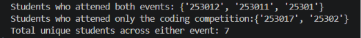
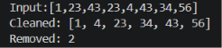
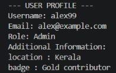

## **1. Set Operations for Survey Analysis**  
A college club organized two events: a _Coding Competition_ and a _Web Design Workshop_. Write a function _`analyze_participants(coding_set, design_set)`_ that takes two sets containing student registration IDs for each event and prints:
1. Students who attended **both** events
2.  Students who attended **only** the Coding Competition.
3. Total unique students across **either** event.

[lab7_1](src/lab7_1.py)
```python
def analyze_participants(coding_set,design_set):
	print(f"Students who attened both events: {coding_set & design_set}")
	print(f"Students who attened only the coding competition:{coding_set - design_set}")
	print(f"Total unique students across either event: {len(coding_set | design_set)}")

coding = {"25301","25302","253011","253012","253017"}
desing = {"25301","253011","25305","253010","253012"}
analyze_participants(coding,desing)
```
## Output:


<div style="page-break-after: always;"></div>

## 2. Write a function `clean_and_sort(items)` that takes a list of integers containing duplicates. The function should:
1. **Remove all duplicates using a Set.**
2. **Convert it back into a List sorted in ascending order.**
3. **Return a tuple containing the cleaned, sorted list along with the total count of duplicate elements removed.
	Example Input: [12, 5, 12, 8, 5, 20, 8]
	Example Output: Cleaned: [5, 8, 12, 20], Duplicates Removed: 3**
	
[lab7_2](src/lab7_2.py)
```python
def clean_and_sort(items):
        count_ = len(items)
        sorted_ = sorted(set(items))
        removed = count_ - len(sorted_)
        return (sorted_,removed)

print("Input:[1,23,43,23,4,43,34,56]")
set_ = clean_and_sort([1,23,43,23,4,43,34,56])
print(f"Cleaned: {set_[0]}\nRemoved: {set_[1]}")
```
## Output:


<div style="page-break-after: always;"></div>

## 3. Write a function
`display_profile(username, email, role="Member", **additional_info)` that prints a formatted user card:
- Print Username, Email, and Role on separate lines.
- Iterate through any extra key-value pairs in additional_info and print them formatted as Key: Value.
**Define a dictionary containing user data like this:**
```python
raw_user_data = {
    "username": "alex99",
    "email": "alex@example.com",
    "role": "Admin",
    "location": "Kerala",
    "badge": "Gold contributor",
}
```
**Function return the dictionary.**

**Print the output in a neat format like this**
**Expected Output:**** 
--- USER PROFILE ---
Username: alex99 
Email: alex@example.com 
Role: Admin
location: Kerala
badge: Gold contributor

<div style="page-break-after: always;"></div>
[lab7_3](src/lab7_3.py)
```python
def display_profile(username, email, role="Member", **additional_info):
    print("--- USER PROFILE ---")
    print(f"Username: {username}")
    print(f"Email: {email}")
    print(f"Role: {role}")
    print(f"Additional Information:")
    for key, value in additional_info.items():
        print(f"{key} : {value}")
    return {"username": username, "email": email, "role": role, **additional_info}

raw_user_data = {
    "username": "alex99",
    "email": "alex@example.com",
    "role": "Admin",
    "location": "Kerala",
    "badge": "Gold contributor",
}

display_profile(**raw_user_data)
```
## Output:
